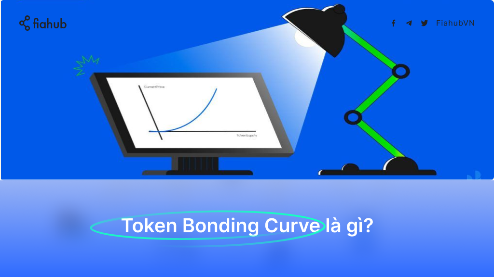
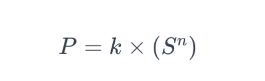
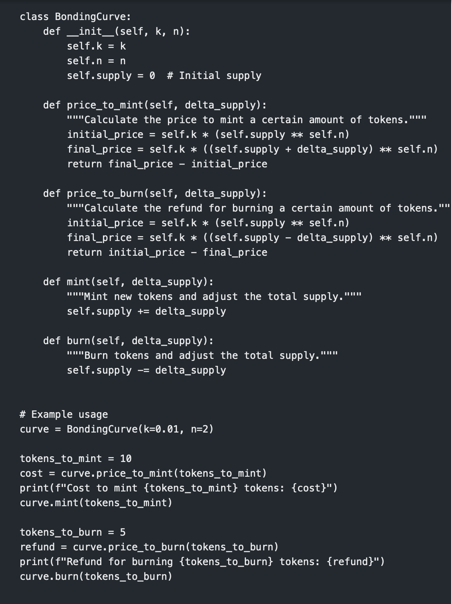

Token Bonding Curve là gì?



Token Bonding Curve là các mô hình toán học phác thảo mối tương quan giữa giá của token và tổng nguồn cung của nó. Hãy giải nghĩa khái niệm này hơn trong bài viết hôm nay!

Token Bonding Curve là gì?
Về cốt lõi, Token Bonding Curve là một công thức đặt giá token theo nguồn cung lưu thông của nó. Công thức phổ biến nhất được sử dụng để mô tả Token Bonding Curve là:




### Công thức Token Bonding Curve

- **P**: Giá của Token.  
- **S**: Nguồn cung cấp Token hiện tại.  
- **k**: Một giá trị không đổi.  
- **n**: Số mũ không đổi, thường nằm trong khoảng từ 0 đến 1.  

Khi bạn mua một Token:
- Token sẽ được đúc, làm tăng tổng nguồn cung (**S**) và giá Token (**P**) theo công thức.  

Khi bạn bán một Token:
- Token sẽ bị phá hủy hoặc "cháy," làm giảm nguồn cung (**S**) và giá Token (**P**).  

---

### Mã Python mẫu để thiết lập Token Bonding Curve

```python
class TokenBondingCurve:
    def __init__(self, k, n):
        self.k = k  # Hằng số không đổi
        self.n = n  # Số mũ không đổi
        self.supply = 0  # Nguồn cung ban đầu
        self.reserve = 0  # Quỹ dự trữ ban đầu

    def calculate_price(self, supply):
        # Công thức tính giá: P = k * (S ^ n)
        return self.k * (supply ** self.n)

    def buy(self, amount):
        # Mua Token, tính giá và tăng nguồn cung
        new_supply = self.supply + amount
        cost = 0
        for i in range(self.supply + 1, new_supply + 1):
            cost += self.calculate_price(i)
        self.supply = new_supply
        self.reserve += cost
        return cost

    def sell(self, amount):
        # Bán Token, giảm nguồn cung và hoàn trả giá trị
        if amount > self.supply:
            raise ValueError("Không đủ nguồn cung để bán")
        new_supply = self.supply - amount
        refund = 0
        for i in range(self.supply, new_supply, -1):
            refund += self.calculate_price(i)
        self.supply = new_supply
        self.reserve -= refund
        return refund

# Ví dụ sử dụng
curve = TokenBondingCurve(k=0.1, n=0.5)

# Mua 10 Token
cost = curve.buy(10)
print(f"Chi phí để mua 10 Token: {cost}")

# Bán 5 Token
refund = curve.sell(5)
print(f"Hoàn tiền khi bán 5 Token: {refund}")


### Mô tả các phương thức

1. **`calculate_price`**:  
   - Tính giá của Token dựa trên nguồn cung hiện tại (**S**) bằng công thức:  
     \[
     P = k \cdot (S^n)
     \]  
   - Trả về giá của Token tại mức cung ứng cụ thể.

2. **`buy`**:  
   - Tính tổng chi phí để mua một số lượng Token nhất định.  
   - Cập nhật nguồn cung (**S**) và quỹ dự trữ (**reserve**) sau khi giao dịch.  
   - Lặp qua từng Token được mua để tính tổng chi phí theo mức giá tăng dần.

3. **`sell`**:  
   - Tính số tiền hoàn lại khi bán một số lượng Token nhất định.  
   - Cập nhật nguồn cung (**S**) và giảm quỹ dự trữ (**reserve**) sau khi giao dịch.  
   - Lặp qua từng Token được bán để tính giá trị hoàn lại theo mức giá giảm dần.

---

### Ghi chú:
- Bạn có thể điều chỉnh các tham số `k` (hằng số không đổi) và `n` (số mũ không đổi) để phù hợp với mô hình kinh tế của Token.  
- Giá trị của `k` quyết định tốc độ thay đổi giá, trong khi `n` xác định hình dạng của đường cong giá.




### Điều làm nên sự khác biệt của các Token Bonding Curve

Token Bonding Curve đóng vai trò là **nhà tạo lập thị trường tự động**. Không giống như các sàn giao dịch truyền thống, nơi giá được đặt theo lệnh mua và bán, ở đây, đường cong xác định trước sẽ quyết định giá. Cơ chế tự điều chỉnh này mang lại nhiều lợi ích:

#### Lợi ích chính:
- **Luôn thanh khoản**: Nhà tạo lập thị trường tích hợp các Token Bonding Curve đảm bảo rằng Token luôn có sẵn để mua hoặc bán, loại bỏ sự phụ thuộc vào các bên bên ngoài.
- **Định giá minh bạch**: Với tính chất được xác định trước của đường cong và công thức của nó, người tham gia có thể dự đoán sự thay đổi trong nguồn cung sẽ tác động đến giá của Token như thế nào.
- **Phân phối công bằng**: Sử dụng Token Bonding Curve để phân phối Token ban đầu thường được coi là công bằng hơn vì nó bắt đầu từ điểm giá thấp nhất.
- **Tạo vốn**: Nguồn vốn được biểu thị bằng khu vực bên dưới đường cong có thể được các dự án sử dụng cho các hoạt động phát triển khác nhau.
- **Giá trị Token vốn có**: Đường cong đảm bảo giá sàn cơ bản, cho thấy Token luôn giữ giá trị và có thể được giao dịch dựa trên mức giá hiện tại của đường cong.

---

### Ứng dụng thực tế của Token Bonding Curve

1. **Token luôn hiện diện**:  
   Các nền tảng như Bancor sử dụng Token Bonding Curve để cho phép tạo Token không bị gián đoạn, đảm bảo tính thanh khoản ổn định và mô hình định giá được thiết lập dựa trên công thức.

2. **Tiền tệ địa phương**:  
   Ví dụ: Kinh tế cơ sở sử dụng Token Bonding Curve bằng tiền tệ cộng đồng, nâng cao giá trị của chúng khi sự tham gia của cộng đồng tăng lên.

3. **Huy động vốn dân chủ**:  
   Huy động vốn phi tập trung thông qua Token Bonding Curve đang được các nền tảng như Aragon và Gnosis khám phá, đưa ra mức giá minh bạch và phân phối Token công bằng.

4. **Quản lý dữ liệu thông qua Token**:  
   TCR (Cơ quan đăng ký Token được quản lý) như Ocean Protocol sử dụng Token Bonding Curve để quản lý dữ liệu, trong đó việc đặt cược Token thúc đẩy tính chính xác và toàn vẹn của dữ liệu.

5. **Các tổ chức tự quản (DAO)**:  
   Các DAO như MolochDAO tận dụng Token Bonding Curve để quản lý thành viên, đưa ra cơ chế tài trợ thành viên có thể dự đoán được.
